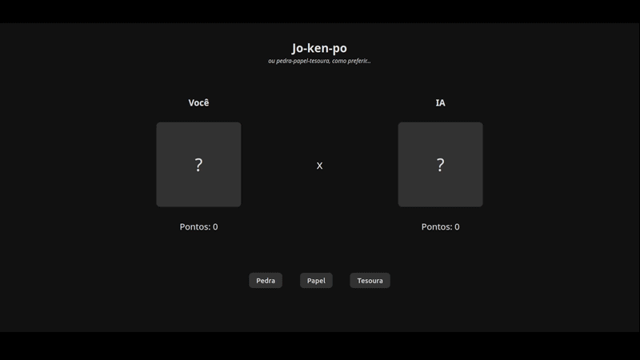

# "Jo-ken-Po"

Um pequeno projeto de aprendizado em navegador que implementa o clássico jogo Pedra–Papel–Tesoura usando HTML, CSS e JavaScript puros.

## Demo

> Exemplo de uma partida mostrando interações e atualização de pontuação.

Live preview: https://jo-ken-p.netlify.app/

---

## Sobre

Este projeto foi criado para praticar manipulação do DOM, tratamento de eventos e conceitos fundamentais de JavaScript.

## Funcionalidades

- Jogo para um jogador contra o computador.
- Controle de pontuação na sessão (reinicia ao recarregar a página).
- Interface simples e responsiva com animações básicas.
- Separação clara entre marcação, estilos e lógica.

## Arquivos do projeto

- `index.html` — página principal e marcação do jogo
- `css/main.css` — estilos principais
- `css/utilities.css` — classes utilitárias
- `js/index.js` — lógica do jogo
- `js/uiEvents.js` — manipuladores de eventos da UI

## Habilidades praticadas

### JavaScript

- Escrita de funções bem definidas e organização da lógica
- Aninhamento de funções e compreensão de escopo
- Estado simples (contadores de pontuação) e controle de fluxo (switch/case)
- Métodos de string e padrões de iteração

### Git & GitHub

- Fluxos básicos de controle de versão (commits, reset/revert)
- Gerenciamento do repositório remoto e sincronização do README

## Motivação

Este projeto ajudou a reforçar conceitos fundamentais de JavaScript (funções, escopo) e habilidades práticas de frontend, como atualização do DOM e tratamento de eventos.
